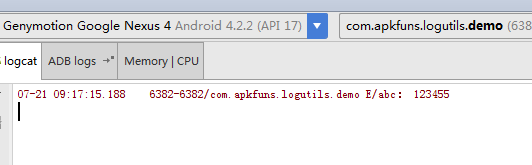

# LogUtils
More convenient and easy to use android Log manager

### screenshot
##### 效果图

##### 日志说明


### Simple
```java

// 输出字符串
LogUtils.d("12345");

// 输出参数
LogUtils.d("12%s3%d45", "a", 0);

// 输出异常
LogUtils.d(new NullPointerException("12345"));

// 输出对象
Person person = new Person();
person.setAge(11);
person.setName("pengwei");
person.setScore(37.5f);
LogUtils.d(person);

// 对象为空
LogUtils.d(null);

// 输出json（json默认debug打印）
String json = "{'a':'b','c':{'aa':234,'dd':{'az':12}}}";
LogUtils.json(json);

// 其他用法
LogUtils.v("12345");
LogUtils.i("12345");
LogUtils.w("12345");
LogUtils.e("12345");
LogUtils.wtf("12345");
```

### options
```java
// 配置日志是否输出(默认true)
LogUtils.configAllowLog = false;

// 配置日志前缀
LogUtils.configTagPrefix = "abc-";
```

### Gradle
```groovy
compile '***'
```

### History
* **1.0.0 (2015/07/13)**
    - 打印对象，字符串，异常，且显示文件行数
<br/>
* **1.0.1 (2015/07/22)**
    - 打印json字符串


## About
* Blog: [apkfuns.com](http://apkfuns.com?from=github)
* Email: [pengwei1024@gmail.com](http://mail.qq.com/cgi-bin/qm_share?t=qm_mailme&email=pengwei1024@gmail.com)

### Thanks
thanks to [wyouflf/xUtils](https://github.com/wyouflf/xUtils) 和[orhanobut/logger](https://github.com/orhanobut/logger)

### License
<pre>
Copyright 2015 Orhan Obut

Licensed under the Apache License, Version 2.0 (the "License");
you may not use this file except in compliance with the License.
You may obtain a copy of the License at

   http://www.apache.org/licenses/LICENSE-2.0

Unless required by applicable law or agreed to in writing, software
distributed under the License is distributed on an "AS IS" BASIS,
WITHOUT WARRANTIES OR CONDITIONS OF ANY KIND, either express or implied.
See the License for the specific language governing permissions and
limitations under the License.
</pre>
