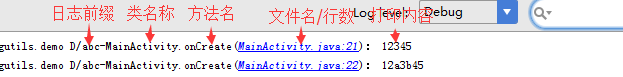
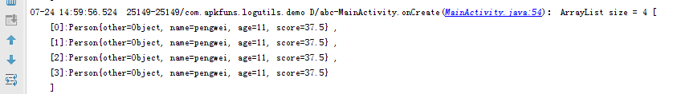
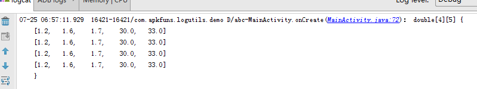
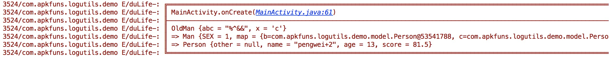

# LogUtils
 


#### More convenient and easy to use android Log manager

## 1. Features
* 支持直接打印数据集合, 如List、Set、Map、数组等
* 全局配置log输出, 个性化设置Tag
* 准确显示调用方法、行，快速定位日志所在文件位置
* 支持android系统复杂对象Intent、Bundle、Message等打印
* 提供空实现 release-no-op版本
* 支持高性能日志写入文件(基于mmap)
* 兼容Android Studio 3.1 日志格式

## 2. screenshot
##### 日志说明

##### 个性化设置Tag

##### 打印数据列表

##### 打印数组

##### 打印对象本身属性和继承的属性

##### 打印系统对象Intent


## 3. Simple
```java

// 输出字符串
LogUtils.d("12345");

// 输出参数
LogUtils.d("12%s3%d45", "a", 0);

// 输出异常
LogUtils.d(new NullPointerException("12345"));

// 输出对象
Person person = new Person();
person.setAge(11);
person.setName("pengwei");
person.setScore(37.5f);
LogUtils.d(person);

// 对象为空
LogUtils.d(null);

// 输出json（json默认debug打印）
String json = "{'a':'b','c':{'aa':234,'dd':{'az':12}}}";
LogUtils.json(json);

// 打印数据集合
List<Person> list1 = new ArrayList<>();
for(int i = 0; i < 4; i++){
    list1.add(person);
}
LogUtils.d(list1);

// 打印数组
double[][] doubles = {{1.2, 1.6, 1.7, 30, 33},
                {1.2, 1.6, 1.7, 30, 33},
                {1.2, 1.6, 1.7, 30, 33},
                {1.2, 1.6, 1.7, 30, 33}};
LogUtils.d(doubles);

// 自定义tag
LogUtils.tag("我是自定义tag").d("我是打印内容");

// 其他用法
LogUtils.v("12345");
LogUtils.i("12345");
LogUtils.w("12345");
LogUtils.e("12345");
LogUtils.wtf("12345");
```

### options
方法 | 描述 | 取值 | 缺省
------- | ------- | ------- | -------
configAllowLog | 是否允许日志输出 | boolean | true
configTagPrefix | 日志log的前缀 | String | "LogUtils"
configShowBorders | 是否显示边界 | boolean | false
configLevel | 日志显示等级 | LogLevelType | LogLevel.TYPE_VERBOSE
addParserClass | 自定义对象打印 | Parser | 无
configFormatTag | 个性化设置Tag | String | %c{-5}
configMethodOffset | 方法偏移量 | int | 0

###### 写入日志文件参数
方法 | 描述 | 取值 | 缺省
------- | ------- | ------- | -------
configLog2FileEnable | 是否支持写入文件 | boolean | false
configLog2FilePath | 写入日志路径 | String | 无
configLog2FileNameFormat | 写入日志文件名 | string | %d{yyyyMMdd}.txt
configLog2FileLevel | 写入日志等级 | LogLevelType | LogLevel.TYPE_VERBOSE
configLogFileEngine | 写入日志实现 | LogFileEngine | 无
configLogFileFilter | 写入日志过滤 | LogFileFilter | 无

##### Demo
```java
LogUtils.getLogConfig()
                .configAllowLog(true)
                .configTagPrefix("MyAppName")
                .configShowBorders(true)
                .configFormatTag("%d{HH:mm:ss:SSS} %t %c{-5}")

# 支持写入日志到文件
 LogUtils.getLog2FileConfig().configLog2FileEnable(true)
                // targetSdkVersion >= 23 需要确保有写sdcard权限
                .configLog2FilePath("/sdcard/项目文件夹/logs/")
                .configLog2FileNameFormat("%d{yyyyMMdd}.txt")
                .configLogFileEngine(new LogFileEngineFactory());
```

##### configFormatTag参数详解
变量 | 简写 | 描述  | 参数 | 示例 | 输出结果
------- | ------- | -------   | -------  | ------- | -------
%% | 无 | 转义% | 无|%%d|%d
%date | %d | 当前时间  | 格式化时间,如HH:mm:ss|%d{HH:mm:ss:SSS}|10:00:46:238
%thread | %t | 当前线程名称 | 无|%t|thread-127
%caller | %c | 线程信息和类路径  |一般用%c{-5}就好了，用法为%c{整数}或者%caller{整数}，整数为包名路径，如路径为`com.apkfuns.logutils.demo.MainActivity.onCreate(MainActivity.java:135)`,%c{1}输出`com`，以.分割的第一个,如果小于0就是排除前面n个，如%c{-1} ，结果为`apkfuns.logutils.demo.activity.MainActivity.onCreate(MainActivity.java:135)`,|%c{-5}|MainActivity.onCreate(MainActivity.java:135)

##### 自定义对象打印
实现Parser<T>接口，并实现parseClassType() 和parseString()方法,再通过addParserClass()配置到LogUtil
<a href='./doc/custom_parser.md'>详细文档</a>


## 4. Usage

### Gradle
```groovy
implementation 'com.apkfuns.logutils:library:1.7.5'
```

##### release-no-op版本
```groovy
debugImplementation 'com.apkfuns.logutils:library:1.7.5'
releaseImplementation 'com.apkfuns.logutils:logutils-no-op:1.7.5'
```

#### 日志写入到文件
- 依赖log2file库 (基于[Log4a](https://github.com/pqpo/Log4a)实现）

```java
implementation 'com.apkfuns.log2file:log2file:1.3.0'


LogUtils.getLog2FileConfig().configLogFileEngine(new LogFileEngineFactory(context));
```

- 自己实现日志写入文件 (实现LogFileEngine接口)

```java
public class MyLogFileEngine implements LogFileEngine {

    // logFlile 日志文件， logContent 日志内容，LogFileParam日志参数
    @Override
    public void writeToFile(File logFile, String logContent, LogFileParam params) {
        ....
    }
}
...
LogUtils.getLog2FileConfig().configLogFileEngine(new MyLogFileEngine());
```
别忘了添加写文件权限

```
<uses-permission android:name="android.permission.WRITE_EXTERNAL_STORAGE"/>
```

#### mmap 日志原理
- [高性能]日志优先写到内存映射文件，和写内存一样高效
- [保证日志不丢失]日志超过4k立即写入文件，每次程序重新启动立即写入，或者端上调用`LogUtils.getLog2FileConfig().flushAsync()`立即写入


## 5. Skills
* [从Log切换到LogUtils](./doc/log_to_logutils.md)
* [为LogUtils设置快捷键](./doc/logutils_templates.md)
* [修改LogCat显示字体颜色](./doc/logcat_color.md)


## 6. Thanks
* thanks to [tinybright](https://github.com/tinybright)、[DrSlark](https://github.com/DrSlark)'s advice.
* thanks to [wyouflf/xUtils](https://github.com/wyouflf/xUtils)、[orhanobut/logger](https://github.com/orhanobut/logger)、
[ZhaoKaiQiang/KLog](https://github.com/ZhaoKaiQiang/KLog)、[noveogroup/android-logger](https://github.com/noveogroup/android-logger)

## 7. License
<pre>
Licensed under the Apache License, Version 2.0 (the "License");
you may not use this file except in compliance with the License.
You may obtain a copy of the License at

   http://www.apache.org/licenses/LICENSE-2.0

Unless required by applicable law or agreed to in writing, software
distributed under the License is distributed on an "AS IS" BASIS,
WITHOUT WARRANTIES OR CONDITIONS OF ANY KIND, either express or implied.
See the License for the specific language governing permissions and
limitations under the License.
</pre>
