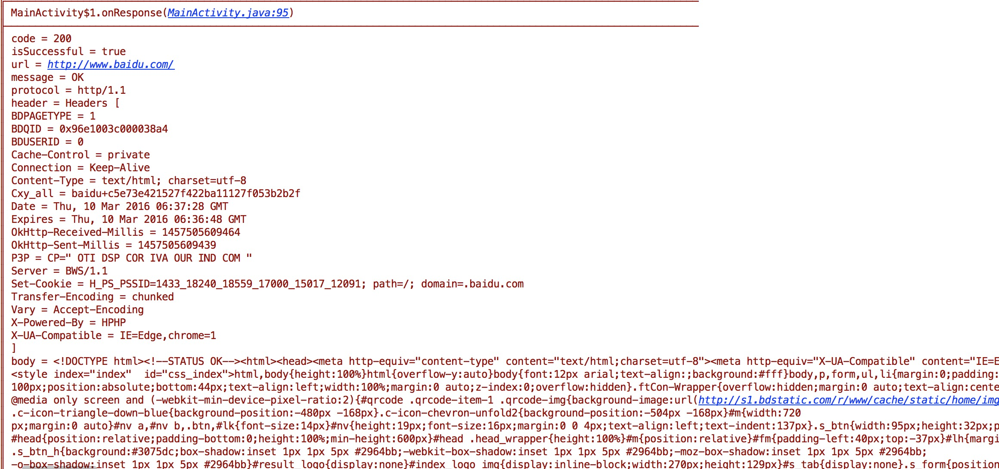

## 自定义对象打印器

### 使用场景
举个例子，网络请求如果用的OkHttp，经常需要看网络请求参数，如发送请求的内容Request，和服务器返回的内容
Response，Request和Response都是一个复杂的对象，包含了诸多的内容，如header，params等等

### 使用方法
继承Parser类，并实现parseClassType()和String parseString(T t)两个方法。

### Demo
#### 请求代码
```java
OkHttpClient client = new OkHttpClient();
        Request request = new Request.Builder()
                .url("http://www.baidu.com").build();
        client.newCall(request).enqueue(new Callback() {
            @Override
            public void onFailure(Call call, IOException e) {
                LogUtils.e(e);
            }

            @Override
            public void onResponse(Call call, Response response) throws IOException {
                LogUtils.e(response);
            }
        });
```

#### 自定义OkHttpResponseParse.java
```java
package com.apkfuns.logutils.demo.activity;

import com.apkfuns.logutils.Parser;

import java.io.IOException;

import okhttp3.Headers;
import okhttp3.Response;

/**
 * Created by pengwei on 16/3/10.
 */
public class OkHttpResponseParse implements Parser<Response> {
    @Override
    public Class<Response> parseClassType() {
        return Response.class;
    }

    @Override
    public String parseString(Response response) {
        if (response != null) {
            StringBuilder builder = new StringBuilder();
            builder.append(String.format("code = %s" + LINE_SEPARATOR, response.code()));
            builder.append(String.format("isSuccessful = %s" + LINE_SEPARATOR, response.isSuccessful()));
            builder.append(String.format("url = %s" + LINE_SEPARATOR, response.request().url()));
            builder.append(String.format("message = %s" + LINE_SEPARATOR, response.message()));
            builder.append(String.format("protocol = %s" + LINE_SEPARATOR, response.protocol()));
            builder.append(String.format("header = %s" + LINE_SEPARATOR,
                    new HeaderParse().parseString(response.headers())));
            try {
                builder.append(String.format("body = %s" + LINE_SEPARATOR, response.body().string()));
            } catch (IOException e) {
                e.printStackTrace();
            }
            return builder.toString();
        }
        return null;
    }
}
```

#### 自定义HeaderParse.java
```java
package com.apkfuns.logutils.demo.activity;

import com.apkfuns.logutils.Parser;

import okhttp3.Headers;

/**
 * Created by pengwei on 16/3/10.
 */
public class HeaderParse implements Parser<Headers> {
    @Override
    public Class<Headers> parseClassType() {
        return Headers.class;
    }

    @Override
    public String parseString(Headers headers) {
        StringBuilder builder = new StringBuilder(headers.getClass().getSimpleName() + " [" + LINE_SEPARATOR);
        for (String name : headers.names()) {
            builder.append(String.format("%s = %s" + LINE_SEPARATOR,
                    name, headers.get(name)));
        }
        return builder.append("]").toString();
    }
}
```

#### 在Application中设置LogUtils解析Parse
```java
LogUtils.getLogConfig().addParserClass(OkHttpResponseParse.class);
```


### 结果展示



