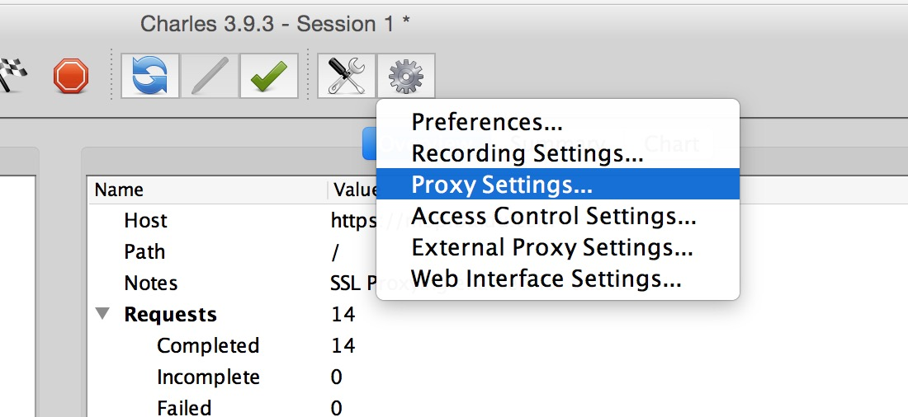
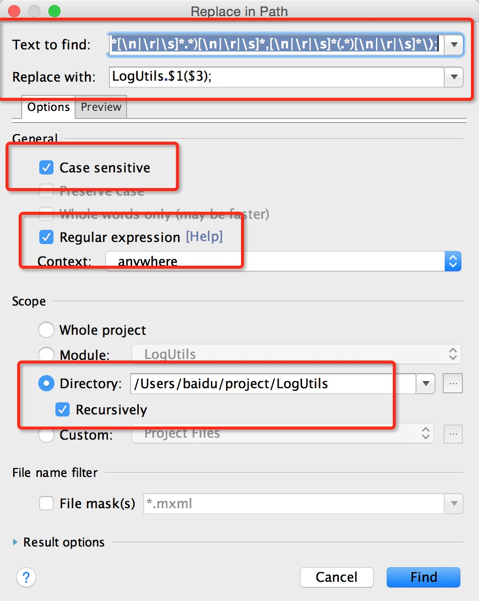

# 从Log切换到LogUtils

也没有想到特别好的方法，提供一种`全局正则替换`的方法。<br/>
如果代码不规范可能无法匹配。<br/>
替换可能出现不完整的情况，所有请在执行替换前将当前代码进行`备份`

<br/>
<br/>
<br/>

### 替换Log.*(TAG, String)  &  Log.*(TAG, String, Throwable) 

```
# 匹配的正则
Log[\n|\r|\s]*\.[\n|\r|\s]*(d|e|i|v|wtf|w)[\n|\r|\s]*\([\n|\r|\s]*(.*[\n|\r|\s]*.*)[\n|\r|\s]*,[\n|\r|\s]*(.*)[\n|\r|\s]*\);

# 替换的正则
LogUtils.$1($3);
```

已经支持的写法，欢迎补充
```java
	    Log.d("abc", "123");

        Log .d("abc", "123");

        Log. d("abc", "123");

        Log.wtf("abc", "123");

        Log.e (TAG, "123");

        Log.i(TAG, value);

        Log.i(TAG, value   );

        Log.e(TAG, "123", new Exception());

        Log.e(TAG, "123",
                new Exception());

        Log.e(TAG,

                "123",

                new Exception());

        Log.d("abc", String.valueOf(1));

        Log.wtf("abc", String.valueOf(1));
```


### 替换import
```java
import android.util.Log;
```

替换为
```java
import com.apkfuns.logutils.LogUtils;
```