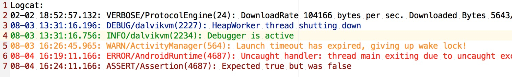
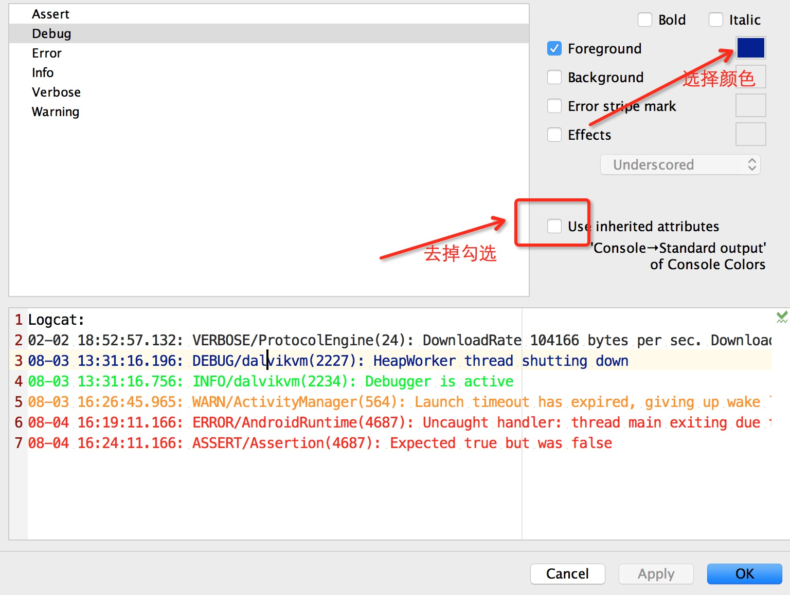

# 修改LogCat显示字体颜色

给Logcat换一个颜色吧,是不是看起来更舒服呢<br/>


打开到Android LogCat设置目录
```
Preferences ==> Editor ==> Colors & Fonts ==> Android Logcat
```
或者
```
Preferences ==> 搜索logcat
```



### 推荐颜色
#### 白色主题
```
Verbose: #000000
Debug: #00007F
Info: #027F00
Warn: #FF7F00
Error: #FF0000
Assert: #FF0000
```


#### 黑色主题
```
Verbose:  #FFFFFF
Debug: #33B5E5
Info: #99CC00
Warn: #FFBB33
Error: #FF4444
Assert: #AA66CC
```