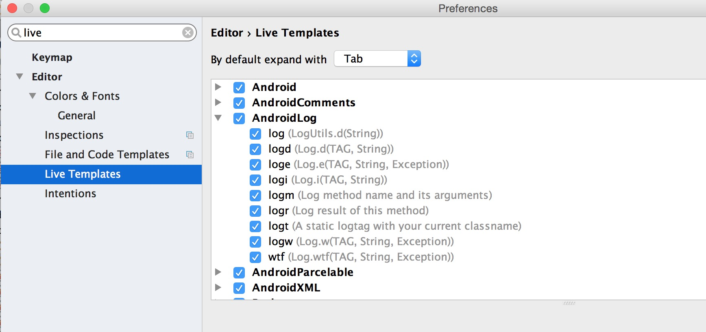
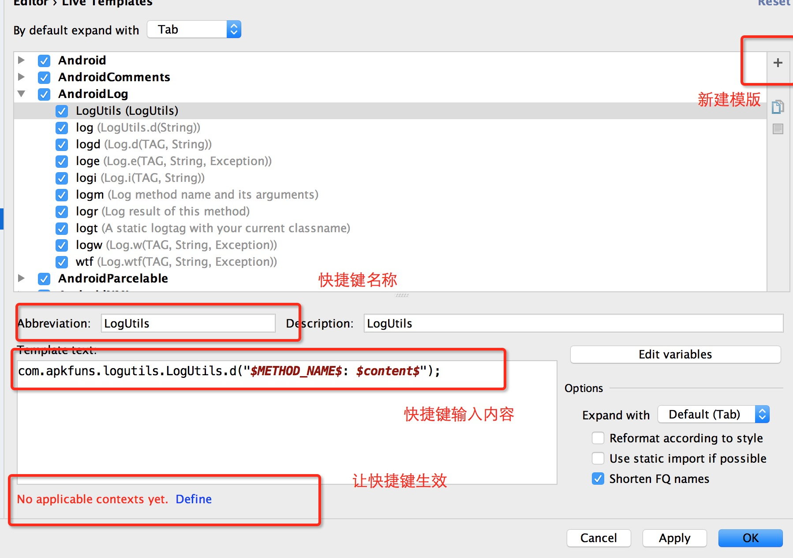
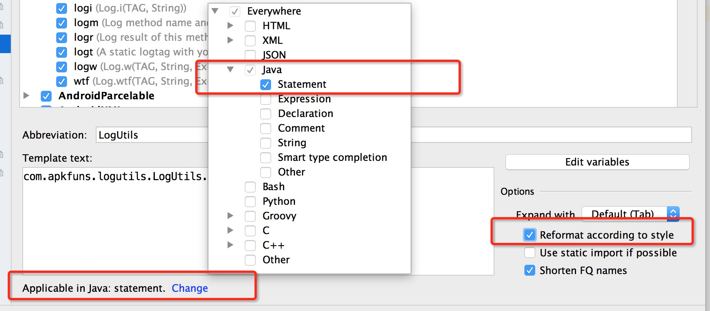

# Android Studio为LogUtils设置快捷键

参考自<a target="_blank" href="https://www.zybuluo.com/shark0017/note/163330">https://www.zybuluo.com/shark0017/note/163330</a>  

android studio --> preferences --> 搜索live --> 选中Live Templates --> Android Log 
--> 点击+号  --> Live Templates
 
 
 

